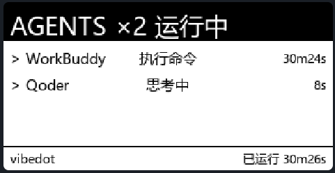
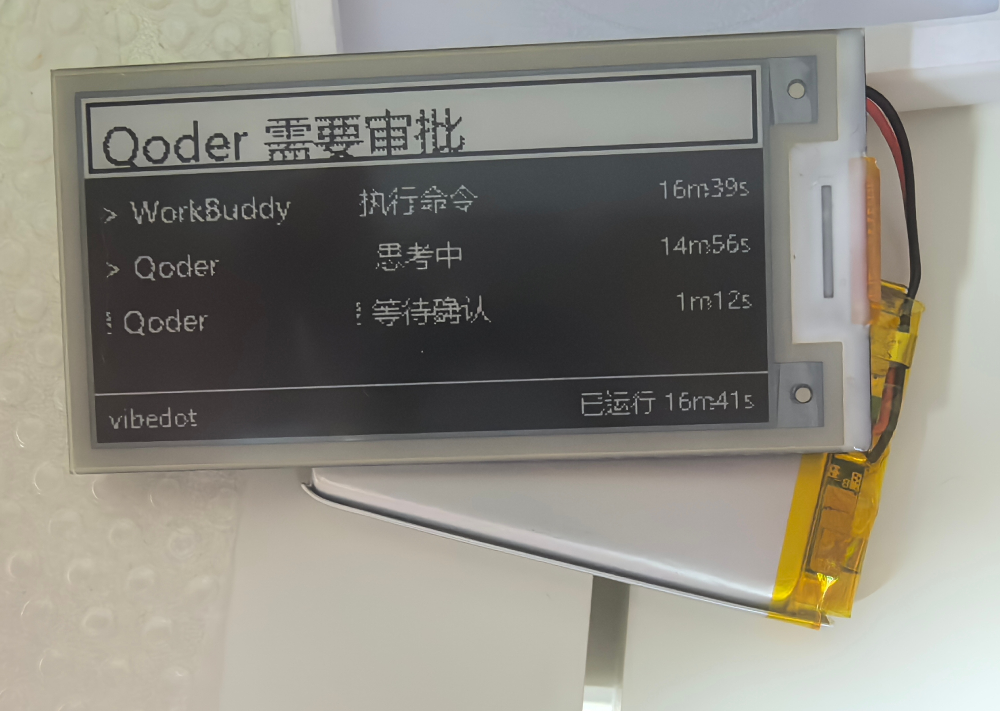

# VibeDot — 水墨屏 AI Agent 状态仪表盘

把Adventure X水墨屏摆件（ESP32-C3 + 2.9" 电子纸 296×152）改造成
**蓝牙无线推送**的多 AI agent 状态仪表盘：随时看到哪个 agent 正在运行、
是否等待审批、运行了多久——无需盯着屏幕，瞄一眼桌面即可。

```
+--------------------------------------+
| AGENTS ×3 运行中                      |
+--------------------------------------+
| > Qoder      编码中      1m32s |
| ! WorkBuddy  等待确认    1m32s |  <- 需要审批时横幅反色提醒
| > Claude     运行中      0m41s |
+--------------------------------------+
| vibedot · 电量 85%       已运行 2m01s |
+--------------------------------------+
```





- 顶部横幅：正常显示 `AGENTS ×N 运行中`；某个 agent **需要审批**或**运行失败**时
  切换为 `<agent名> 需要审批 / 运行失败`（反色突出）
- 中部：正在运行的 agent 列表（名字 / 状态 / 时长，多 agent 并行展示）
- 底部：设备电量（v9 固件上报）+ 服务器已运行时间
- **隐私**：不采集不显示具体执行内容（命令/文件/prompt 均不展示）

## 固件烧录（首次 / 升级）

预编译固件在 [`firmware/vibedot_firmware.bin`](firmware/)（合并镜像，从 `0x0` 整片写入）：

```bash
pip install esptool
esptool.py --chip esp32c3 write_flash 0x0 firmware/vibedot_firmware.bin
```

详见 [firmware/README.md](firmware/README.md)。烧录仅首次需要，之后全靠蓝牙推送。

## 快速开始

### 1. 启动服务器

**Windows**：双击 `start.bat`（可带监控项目路径：`start.bat D:\code\myapp`）
**macOS / Linux**：双击 `start.command`（首次需 `chmod +x start.command`，
也可 `./start.command /path/to/project`）

脚本会自动打开浏览器控制台；或手动启动：

```powershell
python pc\vibedot_server.py --project D:\code\myapp
```

浏览器打开 **http://127.0.0.1:8266** 进入 Web 控制台。

### 2. 接入 AI 工具（Web 控制台点「一键接入」）

| 工具 | 接入方式 | 说明 |
|---|---|---|
| Claude Code | 原生 hooks（9 事件） | 全局或项目级，自动写入 settings.json |
| Qoder | 原生 hooks（9 事件） | 自动写入 `~/.qoder` 与 `~/.qoder-cn` |
| WorkBuddy | 原生 hooks（9 事件） | 与 Claude Code 配置完全同构 |
| Codex CLI / Desktop | notify 回调 | 自动写入 `~/.codex/config.toml` |

接入后运行 AI 工具即自动上报状态，水墨屏实时更新。全部使用各工具的**原生
钩子机制**，不需要 AGENTS.md。

### 3. 连接设备

Web 控制台右侧「设备管理」：

1. **端口检测**：自动识别 ESP32 串口（USB 插入即显示）
2. **蓝牙连接**：点「开启蓝牙」→ 扫描等设备广播窗口（最长 ~75s）→ 连上自动常开
3. 连上后推送按钮可用，点击立即刷屏（按钮有转圈 loading，完成才恢复）

## 刷新策略

- **全刷模式（默认，稳定可靠）**：每次推送全刷（1442ms，黑白闪烁一次）。
  对面板 VCOM 丢失免疫——设备意外复位/掉电后依然正常刷新，无需任何干预。
  （快刷 241ms 无闪烁但依赖 VCOM 存活，设备掉电重启后会静默失效，故默认不用）
- 等待审批 / 完成 / 出错：**立即刷屏**（最小间隔 2s）
- hook 检测到对话 + agent 运行中：**每 15s 刷新一次**（状态持续更新）
- 顶栏右侧**秒级时钟**：每推必变，一眼确认推送链路健康（时钟停 = 设备恢复中）
- 空闲（无 agent 活动）：**每 10 分钟心跳刷新**——时钟走字、状态不过夜
- 推送失败自动指数退避（15→30s），设备重连后立即恢复正常节拍
- agent 结束后 60s 自动从列表移除；"思考中"超 3 分钟无事件自动转完成
  （平台漏发 Stop 事件时的服务端兜底）

## 设备电源管理（全自动，无需碰设备）

设备没有物理按钮，全部由服务器远程控制：

| 操作 | 行为 |
|---|---|
| 开启蓝牙 | 连接设备写常开指令，之后电脑随时可搜可连 |
| 关闭蓝牙 | 设备立即进入低功耗睡眠（55s 睡 / 20s 广播） |
| 面板睡眠 | 屏幕断电省电，下次推送自动全刷唤醒 |

**低功耗循环**：设备默认**永久常开**（断连不自动睡，BLE 持续广播，电脑
随时可连）；只有 Web 控制台「关闭蓝牙」才会进入深度睡眠循环（55s 睡 /
20s 广播）。电脑开机后服务器**自动重连**：断连后 25s 快重试、已连接每
60s 保活，**电脑开机期间设备永不入睡**。全程无需插线、无需按键。

**不要在 Windows 系统蓝牙面板里连接设备**——配对态的系统会抢占连接并
污染蓝牙缓存（推送反复失败的根源）。设备管理全部通过 Web 控制台完成；
系统面板里设备显示"未连接"甚至不出现是正常状态。

**深度睡眠时 USB 串口会从系统消失**——这是正常的。烧录新固件时若提示
找不到端口，拔插一次 USB 或等设备醒来再烧即可。

## 开机自启动

Web 控制台点「安装自启动」，登录后自动静默拉起服务器（`shell:startup/VibeDot.vbs`）。
开机后设备会自动重连并恢复推送，全程无感。

## 常见问题

**Q: 系统蓝牙面板能搜到 VibeDot 但连接失败？**
固件支持免 PIN 配对（Just Works）。先在系统蓝牙设置里删除旧的 VibeDot
条目，再重新添加即可成功连接。注意：系统配对不是必须的，本项目的推送
走独立 GATT 通道，不依赖系统配对。

**Q: 水墨屏不刷新？**
打开 Web 控制台看设备是否在线；确认 AI 工具 hooks 已安装（控制台显示
installed）。若屏幕停在旧画面但控制台推送显示成功，重启服务器并重试
推送（面板深睡唤醒后会自动全刷重建显示）。

**Q: 可以拔掉 USB 用电池吗？**
可以。电池供电下设备自动进入低功耗循环，电脑开机后服务器会自动重连，
推送时自动唤醒全刷。屏幕底部与 Web 控制台会显示电池电量（v9 固件：
ADC 采样换算，首次使用请对照串口 `[BATT]` 日志确认采样通道/分压是否正确）。
电池电量低时蓝牙信号会变弱（表现：连不上），插回 USB 充电即可。

**Q: 需要一直插着串口吗？**
不需要。串口只在烧录新固件时使用，日常全靠蓝牙。
